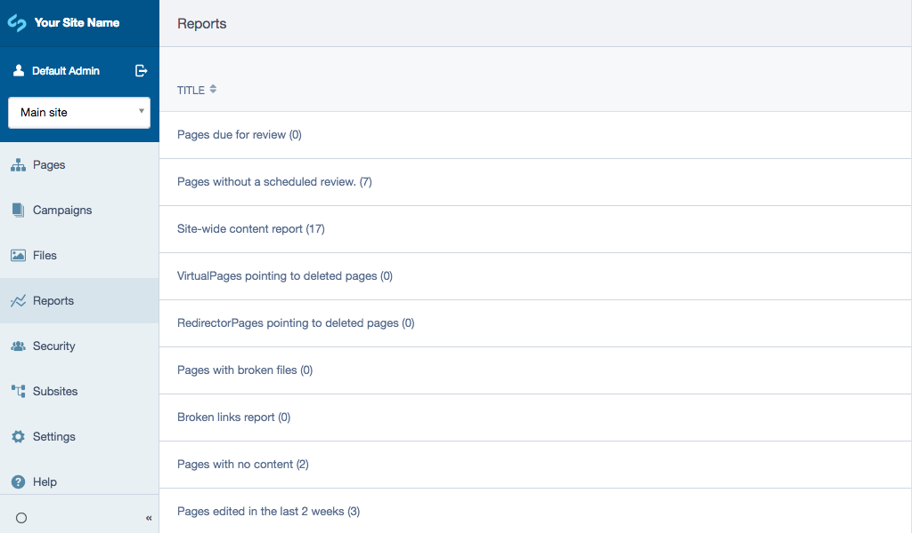
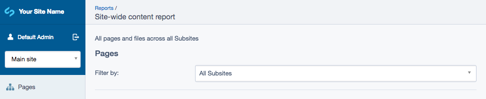

# Site-wide content report user guide

## Viewing the report
To view the report, navigate to 'Reports' in the menu on the left and click on 'Site-wide content report'.
From here you can view the basic information of every page and file in the CMS. To view a specific page or file, simply click on its name.

## Using site-wide content report with subsites
By default, site-wide content report will show pages and files across all subsites. To view the pages and files from a specific subsite, simply select the 'Filter by' dropdown and click on the subsite you wish to view.

